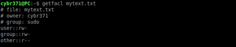
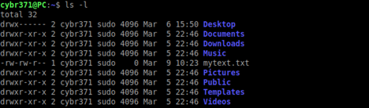
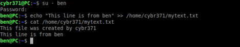
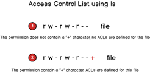
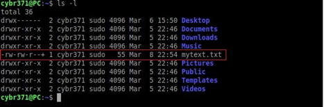
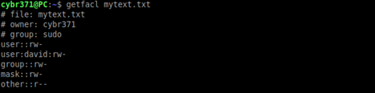
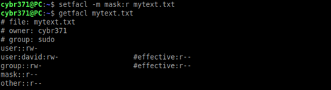
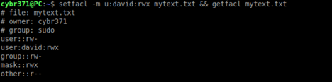
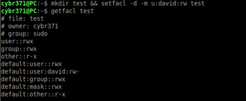
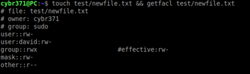

# Lab 1 – Linux Access Control List (ACL)

Notes:

The following accounts have been created on this system and are as following:

| Username | Password | Primary Group |
|:---------|:---------|:--------------|
| cybr371  | cybr371  | sudo          |
|   ben       |     ben     |       sudo        |
|     david     |    david      |       david        |
|    mary      |     mary     |       mary        |
|     masood     |    masood      |       masood        |

*** To check the groups which a user belongs to, issue the command:

        id username  

*** You can always use the command “man <other commands)” to view more information
about a command. man stands for “manual”

Example:

    man ls
    man setfacl

Access Control Lists (ACLs)

**Step 1** - Login to the system using the **cybr371** username and password.

**Step 2** - Open the terminal from the desktop shortcut.

**Step 3** - Create a file named “**mytext.txt**” in the home directory using the following command:

    touch mytext.txt

**Step 4** – add a new line to the file:

    echo “This file was created by cybr371” >> mytext.txt
In the above command >> means the line is appended to the end of the file rather than
rewriting the entire file (which is done using > )

**Step 5** – Check the permissions of the file:

    ls –l mytext.txt

##  Question 1: What does the permission of the file indicate?
  
  
##

**Step 6** - Check the acl of the file by inputting the filename as an argument to the getfacl command.

    getfacl mytext.txt

**Step 7** – Open a new terminal tab and login as user “**ben**” and write the following commands to append a line “This is from ben” to mytext.txt file in the **cybr371’s home directory** (use absolute path)

    su – ben
	echo “This line is from ben” >> /home/cybr371/mytext.txt

And view the content of the file using the cat command.

##  Question 2: login as user “david” in a new terminal tab and write a command to add a line “This is from david” to the mytext.txt file. (Write the command and explain why the operation is either successful or not)
  
  
##

**Step 8** - We want to give user (**david**), a specific set of privileges on the file. Using the **cybr371 terminal tab**, run:

    setfacl -m u:david:rw mytext.txt

-m option (short for --modify) allows us to change the ACLs of a file, rather than the permission descriptions *u:david:rw*.

We have three ‘**sections**’ (*u:david:rw*) divided by colons. In the first one, the **u** stands for user, specifying that we want to set the ACLs for a specific user. It could have been a g for group, or an o for others. In the second section we have the name of the user whom we want to set the permissions for, and in the third, the permissions to assign. Finally, the name of the file on which we want to apply the permissions.

**Step 9** - To see if access control lists are defined for a file or directory, run the ls –l command and look for a “+” character at the end of the permission line.

    ls –l

The + sign at the end of permission column indicates that the file contains an ACL. If we now try to run the ‘getfacl’ command, we can see that its output reflects the changes we made:

    getfacl mytext.txt

An entry has been added for the user david, showing the permissions we assigned to him. An entry for **mask** has also appeared. The mask associated with an ACL defines the maximum effective permissions for any entry in the ACL. The mask value does not affect the standard UNIX user/group/others permissions.

Usage Scenario: if 10 ACL entries had been created for 10 different users and groups with varying permissions, rather than changing them one by one, we could easily limit them all at once using one single command (mask).

**Step 10** - Now repeat the **question two** and add a line!

**Step 11** – We can change the mask value, using the **setfacl** command itself (from the cybr371 terminal):

    setfacl -m mask:r mytext.txt

With the command above, we set the mask to allow only reading permissions (For the user david and . Let’s check the output of **getfacl** command now:

    getfacl mytext.txt

As you can see, not only the changes we made to the mask is now reported, but also the effective permissions for the group owner and the user david are shown. Although the group owner and david have reading and writing permissions on the file, by changing the mask, we have effectively limited their permissions to read only. They are now only allowed to read the file. Try to write to the file as user david and you will notice that permission is denied.

**Step 12** - The ACLs mask also gets automatically re-calculated when we assign or change permissions with setfacl (unless the -n option is specified). Let’s demonstrate that with changing the permissions of the david to rwx and then check the getfacl output:

    setfacl -m u:david:rwx mytext.txt && getfacl mytext.txt

As you can see the mask was re-calculated and it now reflects the maximum permissions present for the user david. Obviously, since the newly set permissions are higher than the mask, the mask is recalculated and there is no need to show the effective permission status.

## Question 3 – Write a command to use ACL to completely deny access to the mytext.txt for david. Write the command in the following box.
  
  
##
## Question 4: write a command to create an ACL for user mary with write and execute permissions only on the file mytext.txt.
  
  
##
## Question 5 – Login as user masood and issue a command to read the content of the file mytext.txt in the cybr371’s home directory. Can the user masood read the file? Write the commands and explain why he can or cannot do so.
  
  
##

Default ACLs

The default ACL is a specific type of permission assigned to a directory, that doesn’t change the permissions of the directory itself, but makes it so that specified ACLs are set by default on all the files created inside of it.

**Step 13** - We create a directory and assign default ACL to it by using the -d option:

    mkdir test && setfacl -d -m u:david:rw test

We can examine the output of the getfacl for that directory:

    getfacl test

The default permissions have been assigned correctly. Now we can verify them by creating a file inside of the test directory and verify its permissions by running getfacl command:

    touch test/newfile.txt && getfacl test/newfile.txt

As expected, the file has been created automatically receiving the ACLs permissions specified above. When you want to erase all the ACLs set, you can run the setfacl with the -b option.